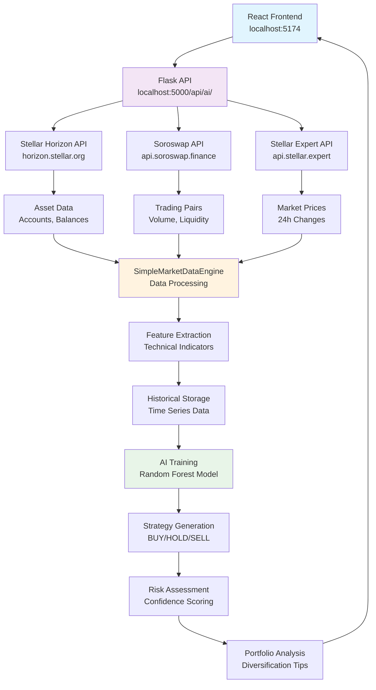

# 🌊 Real Data Flow Diagram

## 📊 API Endpoints & Data Flow

### Frontend → Backend Communication:
- `POST /api/ai/collect-historical-data` → Triggers real data collection
- `POST /api/ai/train-model` → Trains AI on collected data
- `POST /api/ai/strategy-recommendation` → Gets AI predictions
- `GET /api/ai/market-data` → Real-time market overview

### Backend → External APIs:
- **Horizon API**: Asset information, orderbooks, network stats
- **Soroswap API**: Trading pairs, liquidity pools
- **Stellar Expert API**: Price data, market analytics

### Data Processing Flow:
1. **Raw Data Ingestion**: JSON responses from 3 APIs
2. **Data Normalization**: Price formatting, volume calculations
3. **Feature Engineering**: Technical indicators (RSI, SMA, BB)
4. **Model Training**: Random Forest on historical patterns
5. **Strategy Output**: Confidence-scored recommendations
